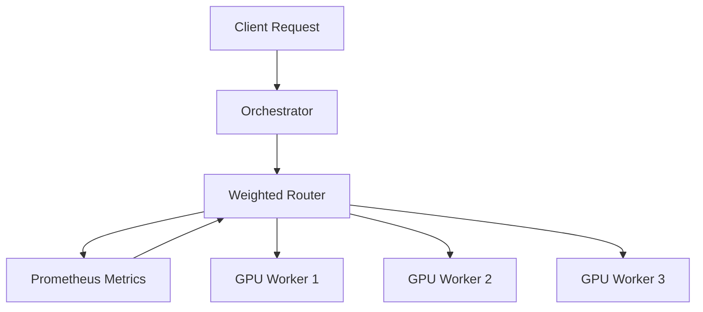

# Weighted Router Design

The Weighted Router is a core component of the AI Code Assistant that intelligently distributes requests to the most appropriate GPU resources based on capabilities, load, and model requirements.

## Architecture Overview

The router implements a weighted load balancing algorithm that considers:

- GPU memory capacity
- Current GPU utilization
- Specific GPU hardware capabilities
- GPU-model compatibility
- Historical performance metrics



## Key Components

### ModelEndpoint

`ModelEndpoint` represents a destination for routing requests. Each endpoint has:

```python
@dataclass
class ModelEndpoint:
    """Represents a model endpoint for routing."""
    name: str
    url: str
```

### GPUInfo

`GPUInfo` encapsulates GPU-specific information that's used for making routing decisions:

```python
class GPUInfo:
    """GPU information provided by external systems."""
    id: str
    name: Optional[str]
    total_memory_mib: float
```

### WorkerConfig

`WorkerConfig` defines configuration parameters for worker instances, with customizations based on GPU type:

```python
class WorkerConfig(TypedDict, total=False):
    """Configuration for worker instances."""
    gpu_id: str
    block_size: int
    gpu_memory_utilization: float
```

## Routing Algorithm

The router uses a multi-stage decision process:

1. **GPU Selection**: Filter available GPUs based on hardware compatibility
2. **Metric Calculation**: Calculate capacity and utilization metrics for each GPU
3. **Configuration Optimization**: Create optimized worker configurations for each GPU type
4. **Endpoint Selection**: Select the best endpoint based on the combined metrics

### GPU Selection Logic

The router can prefer specific GPU types through the `preferred_gpu_type` parameter:

```python
def select_gpu(self, gpu_info: GPUInfo) -> bool:
    if self.preferred_gpu_type and gpu_info.name:
        return self.preferred_gpu_type.lower() in gpu_info.name.lower()
    return True
```

### Hardware-Specific Optimizations

The router applies specialized configurations for different GPU types. For example, NVIDIA T4 GPUs receive custom settings to minimize memory fragmentation:

```python
def build_worker_config(self, gpu_info: GPUInfo) -> WorkerConfig:
    config: WorkerConfig = {"gpu_id": gpu_info.id}
    # Tune settings for NVIDIA T4 GPUs to curb PagedAttention fragmentation
    if gpu_info.name and "t4" in gpu_info.name.lower():
        config["block_size"] = 8
        config["gpu_memory_utilization"] = 0.85
    return config
```

## Metrics and Caching

The router uses Prometheus metrics to track GPU performance and availability. It maintains a cache of GPU metrics to reduce the overhead of frequent metric queries:

```python
self.cache: Dict[str, float] = {}
```

In production, the cached metrics are regularly updated from Prometheus and used in the endpoint selection algorithm.

## Endpoint Selection

The router asynchronously selects the best endpoint based on the calculated metrics:

```python
async def get_best_endpoint(self) -> Optional[ModelEndpoint]:
    """Returns the best endpoint based on weights."""
    # In a real implementation, this would use the cache and weights
    # For now, we just return the first endpoint if available
    return self.endpoints[0] if self.endpoints else None
```

## Future Enhancements

Planned enhancements to the router include:

1. **Dynamic Weight Adjustment**: Automatically adjust weights based on request latency and error rates
2. **GPU Memory Management**: Intelligent allocation of GPU memory based on model size requirements
3. **Batching Support**: Grouping similar requests to optimize throughput
4. **Advanced Failover**: Sophisticated failover mechanisms with health checks
5. **Multi-datacenter Support**: Routing across multiple regions for global deployments
